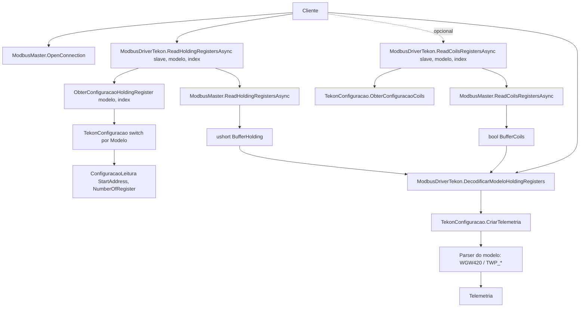

# Fluxo de Leitura Modbus — Toolbox.Automacao.Irrigacao

## Visão geral

Biblioteca .NET 10 para automação de irrigação via **Modbus RTU** sobre `SerialPort` (NModbus 3.0.83). Padrão: **Adapter (transporte)** + **Template Method (driver abstrato)** + **Strategy/Factory por Marca → Modelo**.

## Componentes

### Transporte — `Modbus/ModbusMaster.cs`

Classe `sealed`, encapsula `SerialPort` + `NModbus.IModbusMaster`.

- `OpenConnection()` — abre `SerialPort`, cria `IModbusMaster` RTU. Em falha, lança `Exception`.
- `CloseConnection()` — `Close` no `SerialPort` e `Dispose` no `_master` (com null-check).
- `internal Task<ushort[]> ReadHoldingRegistersAsync(byte slaveAddress, ushort startAddress, ushort numberOfRegisters)`
- `internal Task<bool[]> ReadCoilsRegistersAsync(byte slaveAddress, ushort startAddress, ushort numberOfRegisters)`
- `internal Task WriteSingleCoilAsync(byte slaveAddress, ushort coilAddress, bool value)`

> Métodos de I/O são `internal` — só `ModbusDriver` (mesmo assembly) chama.

### DTO — `Modbus/ConfiguracaoLeitura.cs`

```csharp
public class ConfiguracaoLeitura
{
    public ushort StartAddress { get; init; }
    public ushort NumberOfRegister { get; init; }
}
```

### Driver abstrato — `Drivers/ModbusDriver.cs`

Pipeline comum + 3 abstratos por marca.

**Estado interno (privado)**:
- `BufferHolding: ushort[]`, `BufferCoils: bool[]`
- `Modelo: string`
- `ConfigReadHoldingRegister: ConfiguracaoLeitura?`, `ConfigReadCoils: ConfiguracaoLeitura?`

**API pública**:
- `Task<ushort[]> ReadHoldingRegistersAsync(byte slaveAddress, ushort startAddress, ushort numberOfRegister)`
- `Task<ushort[]> ReadHoldingRegistersAsync(byte slaveAddress, string modelo, byte index)` — resolve config via `ObterConfiguracaoHoldingRegister`
- `Task<bool[]> ReadCoilsRegistersAsync(byte slaveAddress, ushort startAddress, ushort numberOfRegister)`
- `Task<bool[]> ReadCoilsRegistersAsync(byte slaveAddress, string modelo, byte index)` — resolve config via `ObterConfiguracaoCoils`
- `Task WriteSingleCoilAsync(byte slaveAddress, ushort coilAddress, bool value)`
- `Telemetria DecodificarModeloHoldingRegisters()` — chama `Decodificar` com o estado da última leitura

**Abstratos (cada marca implementa)**:
- `protected abstract ConfiguracaoLeitura ObterConfiguracaoHoldingRegister(string modelo, byte index)`
- `protected abstract ConfiguracaoLeitura ObterConfiguracaoCoils(string modelo, byte index)`
- `protected abstract Telemetria Decodificar(Guid id, string modelo, ushort[] buffer, bool[] bufferCoils)`

> ⚠️ Estado mutável: instância **não** thread-safe; `DecodificarModeloHoldingRegisters` exige que a leitura tenha sido feita pela sobrecarga `(slave, modelo, index)`.

### Driver concreto — `Drivers/ModbusDriverTekon.cs`

Herda `ModbusDriver` e delega os 3 abstratos para `TekonConfiguracao`:
- `ObterConfiguracaoHoldingRegister` → `TekonConfiguracao.ObterConfiguracaoHoldingRegister`
- `ObterConfiguracaoCoils` → `TekonConfiguracao.ObterConfiguracaoCoils`
- `Decodificar` → `TekonConfiguracao.CriarTelemetria`

### Strategy/Factory por modelo — `Marcas/Tekon/TekonConfiguracao.cs`

Static class com `switch` por `Modelo` (constantes em `Marcas/Static.cs`):

- `ObterConfiguracaoHoldingRegister(modelo, index)` → `ConfiguracaoLeitura`
  - `Gateway_WGW420` → `WGW420.ConfiguracaoHoldingRegisters()`
  - `Transmitter_TWP_*` → `TWP_4AI4DI1UT.ConfiguracaoHoldingRegisters(index)` (todos transmissores TWP usam o mesmo bloco de 20 registradores)
- `ObterConfiguracaoCoils(modelo, index)` → `ConfiguracaoLeitura`
  - `Transmitter_TWP_4AI4DI1UT` → `TWP_4AI4DI1UT.ConfiguracaoCoilsRegisters(index)`
  - demais → lança `InvalidOperationException("Modelo Inexistente")`
- `CriarTelemetria(moduloId, modelo, buffer, bufferCoils)` → `Telemetria`
  - instancia o parser do modelo (`new WGW420(buffer)`, `new TWP_1AI(buffer)`, …, `new TWP_4AI4DI1UT(buffer, bufferCoils)`) e chama `ObterTelemetria`

### Parsers — `Marcas/Tekon/Modelos/`

`WGW420`, `TWP_1AI`, `TWP_1DI`, `TWP_1UT`, `TWPH_1UT`, `TWP_2AI`, `TWP_2DI`, `TWP_2UT`, `TWP_4AI4DI1UT`. Cada um:
- Recebe `ushort[] buffer` (e `bool[] bufferCoils` no `TWP_4AI4DI1UT`).
- Decodifica (helper `Marcas/Tekon/Conversor.ToFloat(high, low)`).
- Expõe `ObterTelemetria(Guid moduloId)` → `Telemetria`.

### Modelo canônico — `Models/Telemetria.cs`

```csharp
public class Telemetria
{
    public Guid Id { get; set; }
    public DateTime Timestamp { get; set; }
    public string? Status { get; set; }
    public List<Metrica> Metricas { get; set; } = [];
    public Metadados Metadados { get; set; } = null!;
}

public class Metrica
{
    public string Tipo { get; set; } = null!;
    public object Valor { get; set; } = null!;
    public string Unidade { get; set; } = null!;
}

public class Metadados
{
    public string Modelo { get; set; } = null!;
    public int? VersaoFirmware { get; set; }
}
```

## Fluxo de uso

```csharp
// 1) Transporte
var modbus = new ModbusMaster(port: "COM6", baudRate: 9600, dataBits: 8,
    parity: Parity.None, stopBits: StopBits.One,
    readTimeout: 1000, writeTimeout: 1000);
modbus.OpenConnection();

// 2) Driver da marca (use 1 instância por leitura — estado interno)
var driver = new ModbusDriverTekon(modbus);

// 3) Holding registers
await driver.ReadHoldingRegistersAsync(slaveAddress: 1,
    modelo: Modelo.Transmitter_TWP_4AI4DI1UT, index: 1);

// 4) (Opcional) Coils — só modelos que possuem
await driver.ReadCoilsRegistersAsync(slaveAddress: 1,
    modelo: Modelo.Transmitter_TWP_4AI4DI1UT, index: 1);

// 5) Decodificar
Telemetria t = driver.DecodificarModeloHoldingRegisters();

// 6) Escrita (controle)
await driver.WriteSingleCoilAsync(slaveAddress: 1, coilAddress: 0, value: true);

// 7) Encerrar
modbus.CloseConnection();
```

## Diretório

```
Toolbox.Automacao.Irrigacao/
├─ Modbus/
│  ├─ ModbusMaster.cs
│  └─ ConfiguracaoLeitura.cs
├─ Drivers/
│  ├─ ModbusDriver.cs            # abstrato
│  └─ ModbusDriverTekon.cs       # concreto
├─ Marcas/
│  ├─ Static.cs                  # Marca / Modelo (constantes)
│  ├─ EletronicaSanterno/Modelos/Sinus-M.cs   # parser pronto, sem driver/configuracao
│  └─ Tekon/
│     ├─ TekonConfiguracao.cs    # switch por modelo
│     ├─ Conversor.cs            # ushort↔float
│     └─ Modelos/                # WGW420, TWP-*
├─ Models/
│  └─ Telemetria.cs
├─ Comandos/                     # andaime (classes vazias herdando IrrigacaoCommand)
└─ Docs/Fluxo/FluxoLeituraModbus.md
```

## Diagrama (Mermaid)



## Dívidas técnicas pendentes

- **Estado mutável no `ModbusDriver`**: campos `BufferHolding`/`BufferCoils`/`Modelo` exigem ordem de chamada e bloqueiam paralelismo. Evolução: método único `LerEDecodificarAsync(slave, modelo, index)` stateless.
- **Triplo `switch` por string** em `TekonConfiguracao`. Evolução: `IDriverModelo { ConfiguracaoLeitura Holding(byte i); ConfiguracaoLeitura? Coils(byte i); Telemetria Parse(ushort[], bool[], Guid); }` em `Dictionary<string, IDriverModelo>`.
- **`ObterConfiguracaoCoils` lança para modelos sem coils** com mensagem genérica `"Modelo Inexistente"`. Trocar por `null` (e ajustar driver) ou mensagem específica.
- **`ModbusMaster.OpenConnection`**: cria sempre `new SerialPort(Port)` antes do `if (_serialPort.IsOpen)` → guarda nunca dispara em re-conexões; `_master` antigo fica órfão.
- **`throw new Exception(ex.Message)`**: perde stack/tipo. Usar `throw;` ou `InvalidOperationException("...", ex)`.
- **`ModbusMaster` não é `IDisposable`** apesar de gerenciar recursos descartáveis.
- **`EletronicaSanterno`** não plugado: parser `SinusM` existe, faltam `EletronicaSanternoConfiguracao` e `ModbusDriverEletronicaSanterno`.
- **`Comandos/`** sem payload e sem handlers — andaime puro.
- **Endianness `Conversor.ToFloat(high, low)`**: ordem `(buffer[i+1], buffer[i])` aplicada em todos os modelos — confirmar com leitura real.
